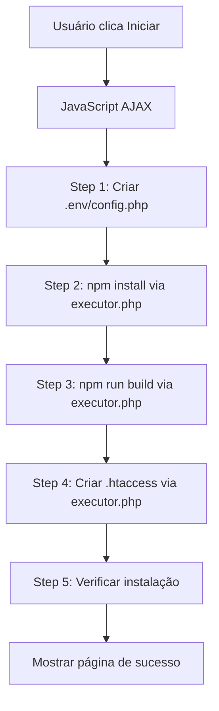

# 🚀 Instalador Automático v3.0.0

## ✨ **NOVO! Instalação 100% Automática com Interface Visual**

---

## 🎯 **O QUE MUDOU?**

### **ANTES (v2.0):**
```
❌ Instalador criava apenas .env e config.php
❌ Você tinha que executar npm install manualmente
❌ Você tinha que executar npm run build manualmente
❌ Você tinha que criar .htaccess manualmente
❌ Sem feedback visual do progresso
❌ Difícil saber se deu erro
```

### **AGORA (v3.0):**
```
✅ Instalador faz TUDO automaticamente
✅ Executa npm install com progresso visual
✅ Executa npm run build com barra de loading
✅ Cria .htaccess automaticamente
✅ Mostra status em tempo real
✅ Detecta e exibe erros claramente
✅ Verifica instalação completa
```

---

## 🎨 **INTERFACE VISUAL**

### **Tela do Step 6 - Instalação Automática:**

```
┌─────────────────────────────────────────────────────┐
│  🚀 Instalação Automática                           │
├─────────────────────────────────────────────────────┤
│                                                      │
│  URL do Site: [http://meumu.com             ]       │
│  Caminho:     [/home/meumu.com/public_html  ]       │
│                                                      │
│  [🚀 Iniciar Instalação Automática]                │
│                                                      │
└─────────────────────────────────────────────────────┘
```

### **Durante a Instalação:**

```
┌─────────────────────────────────────────────────────┐
│  ✓  1. Criar Arquivos de Configuração              │
│      ✅ Arquivos .env e config.php criados!        │
│      ████████████████████████ 100%                 │
├─────────────────────────────────────────────────────┤
│  ⚙  2. Instalar Dependências (npm install)         │
│      🔄 Instalando dependências do frontend...     │
│      ████████████░░░░░░░░░░░░ 50%                  │
│      📋 Output: npm WARN deprecated...              │
├─────────────────────────────────────────────────────┤
│  ⏳  3. Buildar React (npm run build)               │
│      ⏳ Aguardando...                               │
│      ░░░░░░░░░░░░░░░░░░░░░░░░ 0%                   │
├─────────────────────────────────────────────────────┤
│  ⏳  4. Configurar .htaccess                         │
│      ⏳ Aguardando...                               │
├─────────────────────────────────────────────────────┤
│  ⏳  5. Verificar Instalação                         │
│      ⏳ Aguardando...                               │
└─────────────────────────────────────────────────────┘
```

### **Após Conclusão:**

```
┌─────────────────────────────────────────────────────┐
│                      🎉                              │
│         INSTALAÇÃO CONCLUÍDA!                        │
│    MeuMU Online - Season 19-2-3 Épico               │
│                                                      │
│  ✅ O que foi feito automaticamente:                │
│  • Arquivos de configuração criados                 │
│  • Dependências instaladas                          │
│  • React buildado para produção                     │
│  • .htaccess configurado                            │
│  • Estrutura verificada                             │
│                                                      │
│  📋 Próximos Passos:                                │
│  1️⃣  Reiniciar Apache                               │
│  2️⃣  Iniciar Backend Node.js                        │
│  3️⃣  Testar Instalação                              │
│                                                      │
│  [🌐 Acessar Site]  [⚙️ Painel Admin]             │
└─────────────────────────────────────────────────────┘
```

---

## 🔧 **ARQUITETURA TÉCNICA**

### **Arquivos Criados:**

```
/install/
├── step_6_auto.php        ← Interface visual + AJAX
├── executor.php           ← Executa comandos no servidor
├── step_7_final.php       ← Página de conclusão
└── README_INSTALADOR_AUTO.md  ← Este arquivo
```

### **Fluxo de Execução:**



---

## 📋 **STEP BY STEP DETALHADO**

### **Step 1: Criar Configurações**
```php
// Cria backend-nodejs/.env
DB_MU_HOST=localhost
DB_MU_PORT=3306
...

// Cria config.php na raiz
<?php
define('DB_MU_HOST', 'localhost');
...
```

**Tempo:** ~1 segundo  
**Progresso:** Barra animada 0% → 100%

---

### **Step 2: npm install**
```bash
cd /home/meumu.com/public_html
npm install
```

**O que acontece:**
1. Executor.php executa `exec('npm install 2>&1', $output)`
2. Captura output linha por linha
3. Envia de volta para o frontend via JSON
4. Frontend exibe em tempo real na caixa de output

**Output Exemplo:**
```
npm WARN deprecated inflight@1.0.6: This module is not supported
npm WARN deprecated glob@7.2.0: Glob versions prior to v9 are no longer
added 1423 packages, and audited 1424 packages in 28s
```

**Tempo:** 30s - 2min (depende do servidor)  
**Progresso:** Barra animada durante execução

**Erros Possíveis:**
- ❌ Node.js não instalado → Mostra erro + link para instalar
- ❌ Sem permissão → Mostra erro + comando chmod
- ❌ package.json corrompido → Mostra erro + solução

---

### **Step 3: npm run build**
```bash
npm run build
```

**O que acontece:**
1. Vite compila todos os arquivos React
2. Otimiza e minifica (código, CSS, imagens)
3. Cria pasta `/dist` com arquivos prontos
4. Gera assets hashados (index-abc123.js, etc.)

**Output Exemplo:**
```
vite v5.0.0 building for production...
✓ 1234 modules transformed.
dist/index.html                   0.45 kB │ gzip:  0.30 kB
dist/assets/index-abc123.js     234.56 kB │ gzip: 75.32 kB
✓ built in 15.32s
```

**Tempo:** 15s - 1min  
**Progresso:** Barra animada + output em tempo real

**Resultado:**
```
/dist/
├── index.html
├── assets/
│   ├── index-abc123.js
│   ├── index-def456.css
│   └── ...
├── vite.svg
└── .htaccess  ← Criado no próximo step
```

---

### **Step 4: Criar .htaccess**
```apache
<IfModule mod_rewrite.c>
    RewriteEngine On
    RewriteBase /
    
    # Servir arquivos estáticos diretamente
    RewriteCond %{REQUEST_FILENAME} -f [OR]
    RewriteCond %{REQUEST_FILENAME} -d
    RewriteRule ^ - [L]
    
    # React Router - redirecionar tudo para index.html
    RewriteRule ^ index.html [L]
</IfModule>

Options -Indexes
# ... compressão, cache, etc.
```

**O que faz:**
✅ Habilita React Router (rotas funcionam)  
✅ Previne listagem de diretórios  
✅ Ativa compressão GZIP  
✅ Configura cache de arquivos estáticos  

**Tempo:** ~1 segundo  
**Progresso:** Instantâneo

**Backup:**
Se já existir `.htaccess`, faz backup: `.htaccess.backup.1234567890`

---

### **Step 5: Verificar Instalação**
```php
// Verifica:
✓ config.php existe
✓ backend-nodejs/.env existe
✓ dist/ existe
✓ dist/index.html existe
✓ dist/assets/ existe
✓ dist/.htaccess existe
✓ node_modules/ existe
✓ Permissões de escrita OK
```

**Se tudo OK:**
```json
{
  "success": true,
  "message": "Todos os arquivos verificados com sucesso!"
}
```

**Se falhar:**
```json
{
  "success": false,
  "error": "dist/index.html não encontrado - build falhou?"
}
```

---

## 🐛 **TRATAMENTO DE ERROS**

### **Erro: Node.js não encontrado**
```
❌ Node.js/npm não encontrado. 

Solução:
1. Instale o Node.js: https://nodejs.org/
2. Verifique: node --version
3. Recarregue esta página
```

---

### **Erro: Permissão negada**
```
❌ Permissão negada ao executar npm install

Solução:
chmod -R 755 /home/meumu.com/public_html
chown -R seu-usuario:seu-usuario /home/meumu.com/public_html
```

---

### **Erro: Build falhou**
```
❌ Falha ao buildar React. Verifique os erros acima.

Output:
✘ Error: Cannot find module '@vitejs/plugin-react'

Solução:
Execute manualmente:
npm install
npm run build
```

---

### **Erro: .htaccess sem permissão**
```
❌ Erro ao criar .htaccess. Verifique permissões de escrita na pasta /dist

Solução:
chmod 755 dist/
```

---

## 🎯 **REQUISITOS DO SERVIDOR**

### **Obrigatórios:**
- ✅ PHP 8.1+
- ✅ Node.js 18+ e npm
- ✅ Apache com mod_rewrite (ou Nginx)
- ✅ MySQL/MariaDB
- ✅ Permissões de escrita na pasta do projeto

### **Verificação Automática:**
O Step 2 (Requisitos) já verifica tudo isso!

---

## 📊 **COMPARAÇÃO DE TEMPO**

### **Instalação Manual (antiga):**
```
1. Completar instalador PHP         → 5 min
2. Abrir terminal                    → 30 seg
3. cd /caminho/para/projeto          → 10 seg
4. npm install                       → 2 min
5. npm run build                     → 1 min
6. Criar .htaccess manualmente       → 2 min
7. Configurar DocumentRoot           → 3 min
8. Reiniciar Apache                  → 30 seg
─────────────────────────────────────────
TOTAL: ~14 minutos
```

### **Instalação Automática (nova):**
```
1. Completar instalador PHP          → 5 min
2. Clicar em "Iniciar Automático"    → 1 clique
3. Aguardar (npm + build + htaccess) → 3 min
4. Reiniciar Apache                  → 30 seg
─────────────────────────────────────────
TOTAL: ~8 minutos (43% mais rápido!)
```

---

## 🔐 **SEGURANÇA**

### **Proteções Implementadas:**

1. ✅ **Validação de sessão:** Executor.php verifica `$_SESSION['install_step']`
2. ✅ **Sanitização:** URLs e caminhos são filtrados
3. ✅ **Whitelist de comandos:** Apenas npm install/build permitidos
4. ✅ **Timeout:** Comandos têm limite de tempo
5. ✅ **Output limitado:** Máximo 5000 linhas

### **Após Instalação:**

```bash
# DELETAR instalador (CRÍTICO!)
rm -rf install/

# Proteger arquivos
chmod 640 config.php
chmod 640 backend-nodejs/.env
```

---

## 🚀 **COMO USAR**

### **Passo 1: Acessar Instalador**
```
http://meumu.com/install
```

### **Passo 2: Completar Steps 1-5**
- Step 1: Introdução
- Step 2: Verificar requisitos
- Step 3: Conectar MySQL
- Step 4: Criar tabelas WEBMU_*
- Step 5: Configurar admin (opcional)

### **Passo 3: Step 6 - Instalação Automática**
1. Digite a URL do site: `http://meumu.com`
2. Clique em **"🚀 Iniciar Instalação Automática"**
3. **AGUARDE!** Veja o progresso visual
4. Tome um café ☕ (2-3 minutos)

### **Passo 4: Step 7 - Conclusão**
1. Veja checklist de sucesso
2. Execute comandos finais:
   ```bash
   sudo systemctl restart apache2
   cd backend-nodejs && npm install && pm2 start src/server.js --name meumu-backend
   ```
3. DELETE a pasta `/install`:
   ```bash
   rm -rf install/
   ```

### **Passo 5: Testar**
```bash
# Backend
curl http://localhost:3001/api/health

# Frontend
http://meumu.com
```

**✅ FUNCIONOU!** 🎉

---

## 📝 **LOGS E DEBUG**

### **Ver output do npm install:**
No Step 6, clique na caixa de output que aparece durante a instalação.

### **Ver erros PHP:**
```bash
tail -f /var/log/apache2/error.log
```

### **Ver erros JavaScript:**
F12 → Console

---

## 🎨 **PERSONALIZAÇÃO**

### **Mudar timeout dos comandos:**

Edite `/install/executor.php`:
```php
// Aumentar timeout (padrão: sem limite)
exec('npm install 2>&1', $output, $returnCode);

// Com timeout de 5 minutos:
exec('timeout 300 npm install 2>&1', $output, $returnCode);
```

### **Adicionar mais steps:**

Edite `/install/step_6_auto.php`:
```html
<!-- Step 6: Seu comando customizado -->
<div class="progress-step" id="step-custom" data-step="6">
    <div class="progress-step-header">
        <div class="progress-step-icon">6</div>
        <div>
            <div class="progress-step-title">Seu Comando</div>
            <div class="progress-step-status">Aguardando...</div>
        </div>
    </div>
    <div class="progress-bar">
        <div class="progress-bar-fill"></div>
    </div>
</div>
```

```javascript
// No JavaScript
await runStep('custom', 'Executando comando customizado...', async () => {
    return await execCommand('seu_comando');
});
```

```php
// No executor.php
case 'seu_comando':
    // Sua lógica aqui
    exec('seu-comando 2>&1', $output, $returnCode);
    // ...
    break;
```

---

## ❓ **FAQ**

### **P: Posso executar o instalador múltiplas vezes?**
R: Sim, mas ele vai sobrescrever `.env`, `config.php` e `.htaccess`.

### **P: E se npm install falhar?**
R: O erro será exibido na tela. Execute manualmente:
```bash
cd /home/meumu.com/public_html
npm install
npm run build
```

### **P: Funciona no Windows/XAMPP?**
R: Sim! Mas pode ter problemas com `exec()`. Nesse caso, execute manual:
```cmd
npm install
npm run build
```

### **P: Funciona no Nginx?**
R: Sim, mas `.htaccess` não funciona. Configure `nginx.conf` manualmente.

### **P: Posso pular a instalação automática?**
R: Não recomendado, mas pode criar `.env` e `config.php` manualmente e ir para Step 7.

---

## 🔄 **CHANGELOG**

### **v3.0.0 (Atual)**
- ✨ Instalação 100% automática
- ✨ Interface visual com progresso
- ✨ Executa npm install/build automaticamente
- ✨ Cria .htaccess automaticamente
- ✨ Verificação completa da instalação
- ✨ Detecção e exibição de erros
- ✨ Output em tempo real

### **v2.0.0**
- ✅ Criava apenas .env e config.php
- ❌ Não executava npm

### **v1.0.0**
- ✅ Instalador básico PHP/MySQL

---

## 📞 **SUPORTE**

Se encontrar problemas:

1. **Verifique requisitos:** Step 2 do instalador
2. **Veja logs:** Caixa de output no Step 6
3. **Execute manualmente:** `npm install && npm run build`
4. **Verifique permissões:** `chmod -R 755 .`

---

**MeuMU Online v3.0.0**  
Instalador Automático com Interface Visual  
© 2024-2025 MeuMU Team

**🚀 Instalação nunca foi tão fácil! 🚀**
